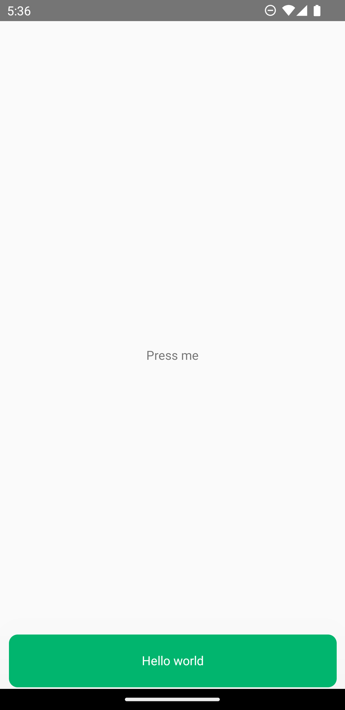

# React Native Toastify
 @react-native-toastify/snackbar allows you to add unique toast message to your app with ease. No more nonsense!
  
## Installation

$ npm i @react-native-toastify/snackbar
$ yarn add @react-native-toastify/snackbar


## Features
  Easy to set up for real, you can make it work in less than few sec!
  Possibility to update a toast
  Can display a custom messages inside the toast!
  And much more !
  
 
## Plugins

React-native-toastify is currently extended with the following plugins.
Instructions on how to use them in your own application are linked below.

| Props | Description |
| ------ | ------ |
| message | Write the message you want to pop it out |
| type | danger , warning , success |


## DEMO

<p float="left">
  
</p>

## Import App.js file:

```sh
import { SnackBar } from '@react-native-toastify/snackbar';
```

## App.js 


    <View style={{flex: 1}}>
    ...
    
      <SnackBar />
    
   
    </View>
 
   
   
   # snack trigger
   
```sh
import { Snack } from '@react-native-toastify/snackbar';
```


##

      Snack("Message","type") 
  

  ##